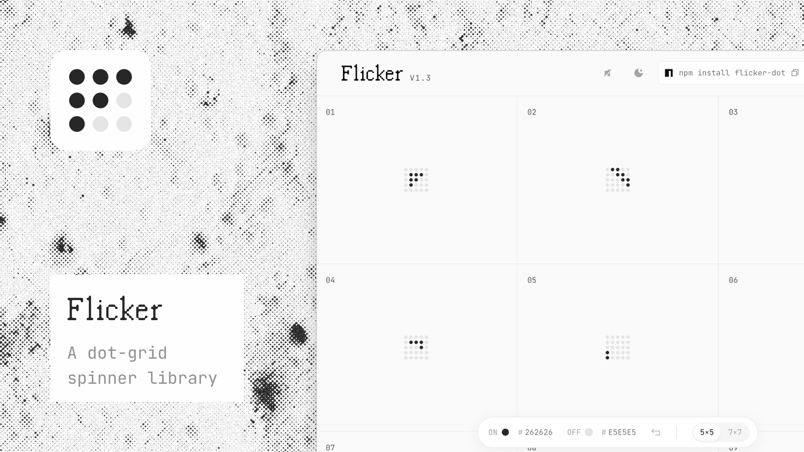

[](https://github.com/laurieesc/flicker-dot/actions/workflows/test.yml)
[](https://www.npmjs.com/package/flicker-dot)
[](./LICENSE)

# flicker-dot

A dot-grid loading spinner for React. 49 dots, one flip-dot animation, zero
runtime dependencies.

Every spinner ships from [flicker.laurie.fyi](https://flicker.laurie.fyi),
where you design the frame-by-frame pattern by hand. This package is the
player. It's the part that actually renders what you built, in your own
app.

```bash
npm install flicker-dot
```

```tsx
import { FlickerSpinner } from 'flicker-dot';

<FlickerSpinner grids={myGrids} />
```

That's the whole API surface for the common case. Everything else in this
README is what happens when "the common case" isn't quite enough.

## Why this exists

Most loading spinners are one of three things: a spinning circle, a pulsing
skeleton, or somebody's Lottie file that's slightly too big for what it's
doing. Flip-dot displays, the mechanical split-flap boards you see in old
train stations, do something different. Each dot is binary, on or off, and
the whole picture is just a sequence of frames. That's a great fit for CSS
keyframes: no JS timer, no re-renders, and a hard mechanical snap between
states instead of an eased fade.

`flicker-dot` is that idea, packaged. You design the dot pattern visually,
export it, and this component plays it back as a real SVG, styled with CSS
custom properties, honoring `prefers-reduced-motion` by default.

More on why this exists as its own thing: [Flicker's origin story](https://www.itdepends.fyi/p/the-only-way-out-is-through).

## Usage

```tsx
import { FlickerSpinner } from 'flicker-dot';

function LoadingState() {
  return (
    <FlickerSpinner
      grids={grids}
      onColor="#262626"
      offColor="#e5e5e5"
    />
  );
}
```

`grids` is the one required prop, an ordered array of frames, where each
frame is a flat array of 49 booleans (a 7×7 grid, indexed `row * 7 + col`).
You'll get this from the [Flicker editor](https://flicker.laurie.fyi) as a
paste-ready export; you're not meant to hand-write it.

To get it: open [flicker.laurie.fyi](https://flicker.laurie.fyi), open or
create a spinner, and go to its Code panel. The CLI tab gives you the
`npm install` command plus a live usage snippet wired to that spinner's
`grids`. The Manual tab exports the same pattern as a static SVG, React
component, Flutter widget, or Lottie JSON, if you'd rather copy the output
directly instead of pulling in this package.

### Props

| Prop | Type | Default | What it does |
|---|---|---|---|
| `grids` | `FlickerGrids` | — | Required. The frame data. |
| `onColor` | `string` | `#262626` | Color of a lit dot. Any valid CSS color. |
| `offColor` | `string` | `#e5e5e5` | Color of an unlit dot. |
| `theme` | `{ on, off }` | — | Shorthand for the pair above. Explicit `onColor`/`offColor` win if both are set. |
| `variant` | `'7x7' \| '5x5'` | `'7x7'` | Full grid, or the derived inner 5×5 "safe area." |
| `size` | `number` | `28` (7×7) / `16` (5×5) | Render size in px. |
| `playing` | `boolean` | `true` | Pause the animation without unmounting it. |
| `speed` | `number` | `1` | Playback rate multiplier. `2` runs twice as fast. |
| `reverse` | `boolean` | `false` | Plays the frame sequence backward. |
| `fit` | `'contain' \| 'cover' \| 'fill'` | `'contain'` | How the grid scales in a non-square box. |
| `title` | `string` | `'Loading'` | Accessible label (`aria-label` + `<title>`). |
| `className` | `string` | — | Passed to the root `<svg>`. |
| `style` | `CSSProperties` | — | Merged into the root `<svg>` style, after the color vars. |

### Theming with CSS variables

`onColor` and `offColor` accept anything CSS accepts, including
`var(--your-token)` or `currentColor`. That means you can theme a spinner
from your app's existing design tokens with no extra plumbing:

```tsx
<FlickerSpinner
  grids={grids}
  onColor="var(--fg)"
  offColor="var(--bg-subtle)"
/>
```

If your CSS variable changes on a `[data-theme="dark"]` toggle, the spinner
follows it automatically, no re-render, no JS theme detection. This is the
whole reason the colors are CSS custom properties on the SVG root instead
of baked into the markup.

### Reduced motion

Every spinner instance carries a scoped `prefers-reduced-motion: reduce`
rule that disables the animation entirely. You don't opt into this. It's
on by default.

## What this package is not

`flicker-dot` renders. It does not export SVG strings, React components,
or Flutter code. The design-time export tooling lives in the Flicker app
itself, not in this package. If you're looking to generate spinner code
rather than render a live component, that's a different tool, and it's
closed source.

There's also no imperative playback controller in this version. No
`ref.play()` / `ref.pause()`. The `playing` and `speed` props cover the
declarative 90% of cases. An imperative API is a real rewrite (particularly
for a future Flutter player), and it's parked until there's a concrete
reason to build it. If you hit that wall, an issue with your use case is
the fastest way to move it up the list.

## Implementations

| Platform | Package | Status |
|---|---|---|
| React | `flicker-dot` (this repo) | Stable |
| Flutter | — | Not yet published. [Ping the maintainer](https://github.com/laurieesc) if you're building one. |

## Contributing

See [CONTRIBUTING.md](./CONTRIBUTING.md). Short version: there's a test
suite, CI runs it on every PR, and a green check is the bar.

## License

MIT © 2026 Laura Escobar
